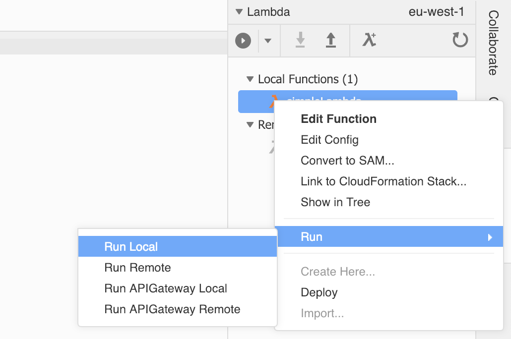

# LAB 2 - Creating Lambda Functions

## LAB Overview

#### This lab will demonstrate:
 * Creating Lambda function
 * Prepating Cloud9 development environment
 * Creating DynamoDB table

## Task 1: Create a simple Lambda function

In this task you will create simple Lambda function and will look into event object.

1. In the AWS Management Console, on the **Services** menu, click **Lambda**.
2. Click **Create function**.
3. Insert a name for your function e.g "YOUR-NAME-LAMBDA".
4. Select "Python 3.6" as a runtime.
5. Select "Choose an existing role" in the Role menu.
6. Select your created in previous lab. "Lambda1-Role" from the "Existing role" menu.
7. Click **Create function**.
8. Download **[simple\_lambda.py][1]** file and paste the file content into lambda function editor.
9. Click **Save** button.
10. Click **Test** button.
11. Download **[simple\_lambda\_test\_payload.json][2]** file and paste the file content into lambda test data editor.
12. Enter a name for "Event name", e.g. "Testevent".
13. Click **Create** button.
14. Click **Test** button.
15. Go to the top of the page and click **Monitoring**.
16. Click **View logs in CloudWatch**.
17. Click on the latest log stream.
18. Look into lambda execution details. Take a look at test data passed to Lambda function as an event.

## Task 2. Prepare Cloud9 environment, import Lambda function and test it locally

In this task you will prepare Cloud9 devevlopment environment to work on our project and will import Lambda function we’ve just created. Then you'll test it locally.

1. In the AWS Management Console, on the **Services** menu, click **Cloud9**.
2. Click **Create environment**.
3. Enter a name for your environment, e.g. "student-x-environment".
4. Click **Next step**.
5. As "Environment type" select *Create a new instance for environment (EC2)*.
6. Select *t2.micro* as "Instance type".

7. Click **Next step**.
8. Review your environment and click **Create environment**.

Wait for your environment, and when it's ready..

9. Select **AWS Resources** panel. 
10. Unwind **Remote Functions**.
11. Select your Lambda function. Right click on it and select **Import**.
12. Click **Import** on the pop-up.

13. Righ click on imported function. Select **Run** and **Run Local**. 
14. As payload enter
``{
    "test" : "blah"
}``
15. Click **Run** button.

## Task 3. Creating a DynamoDB table, a sort key & a secondary index

In this task you will create DynamoDB table and key needed to retrieve data.

1. In the AWS Management Console, on the **Services** menu, click **DynamoDB**.
2. Click **Create table**.
3. Enter a name for your table, e.g. "student-x-table".
4. Name your *Primary key* as "machine_key" and set the type to "String".
5. Check **Add sort key**.
6. Name your "Sort key" as "application_id" and set the type to "String".
7. Uncheck **Use default settings**.
8. Turn off "Auto scaling" by unchecking **Read capacity** and **Write capacity**.
9. Under **Secondary indexes**, click **Add index**.
10. Enter "application_id" as your **Primery key** and set the type to "String".
11. Set "application_id-index" as **Index name**.
12. Click **Add index**.
9. Click **Create**.

## END LAB

  

[1]:	simple_lambda.py
[2]:	simple_lambda_test_payload.json