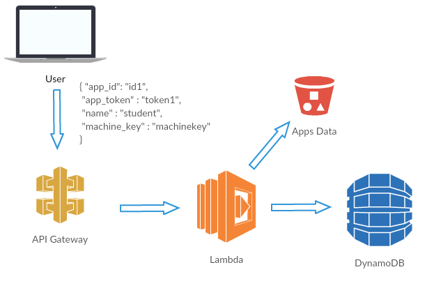
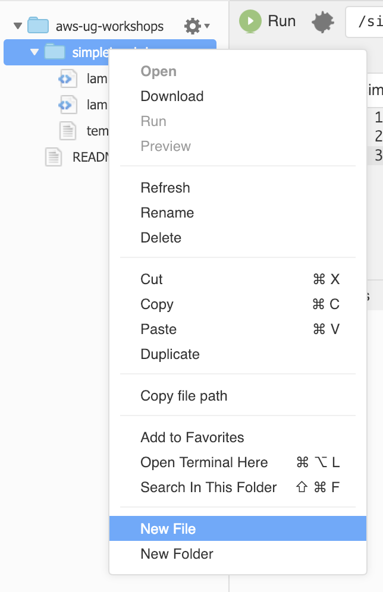
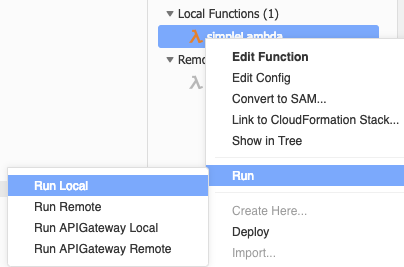
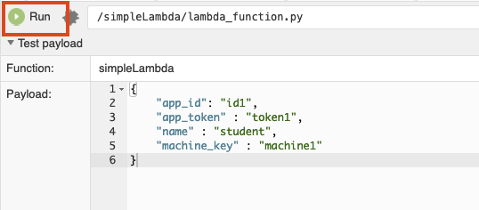
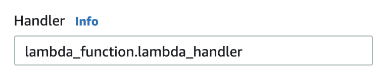
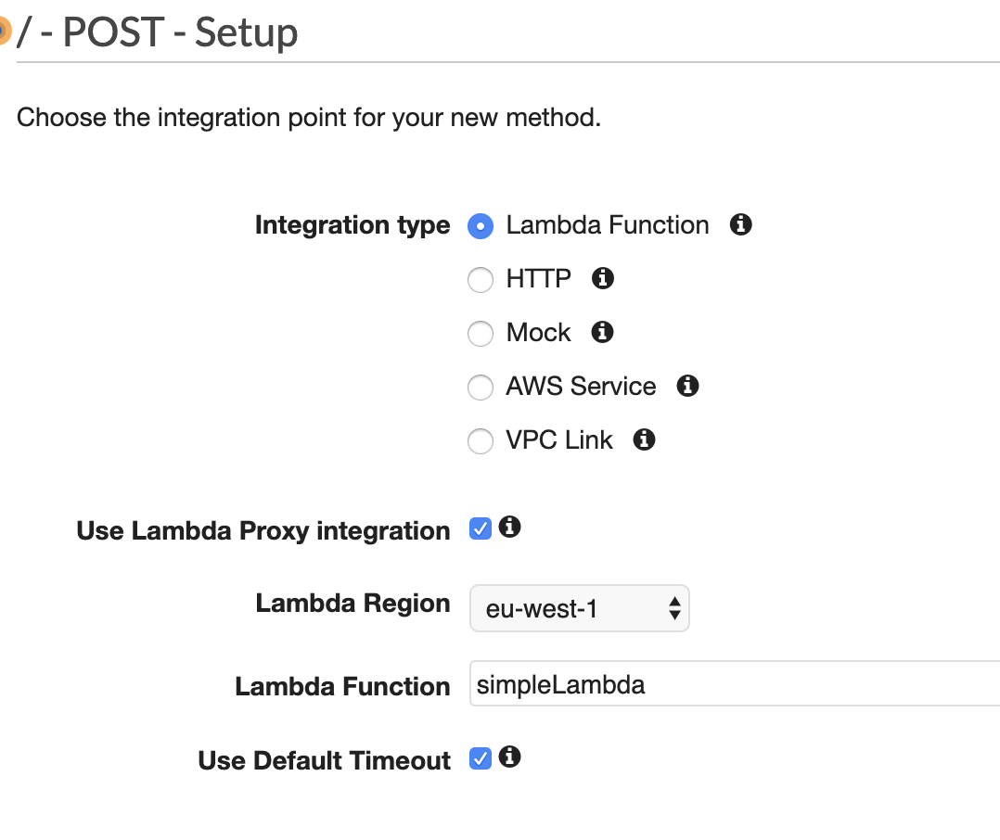
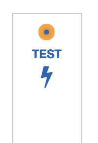
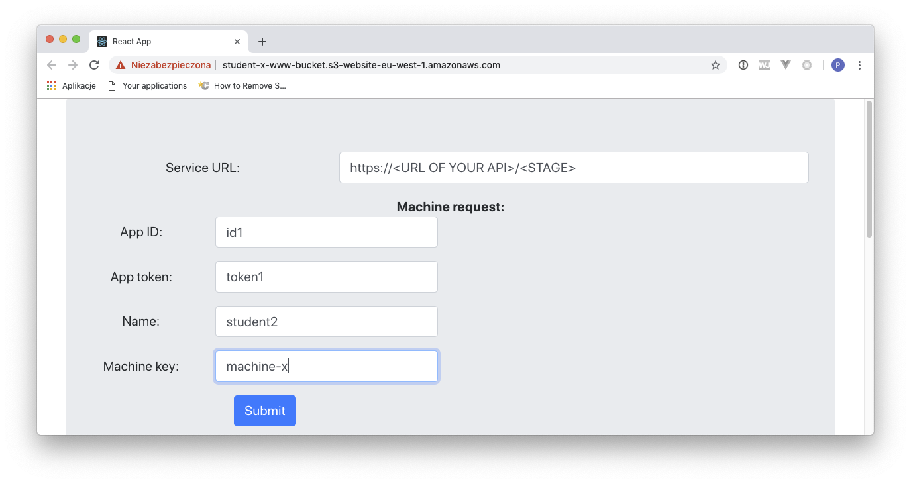
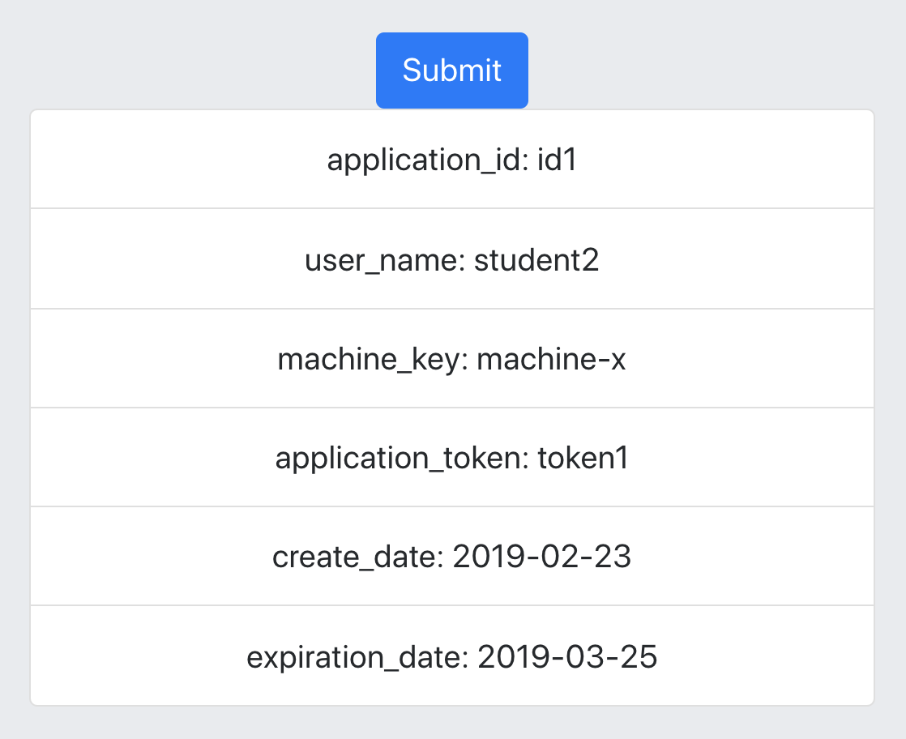

# LAB 3 - Implementing main Lambda function and API

## LAB Overview

#### This lab will demonstrate:
* Using Cloud9 to edit Lambda functions
* Saving and reading data to/from DynamoDB
* Using API Gateway as a Lambda proxy

## Task 1: Editing function

In this task you will add more files to your Lambda function, edit code inside Cloud9, test the code locally and deploy changes to AWS Lambda.

1. In the AWS Management Console, on the **Services** menu, click **Cloud9**.
2. Find your environment and open by clicking **Open IDE**.
3. Wait for your environment and when it's ready right click on your lambda folder and select **New file** from the menu.

4. Enter a name for your file "app_exceptions.py".
5. Download [app_exceptions.py](app_exceptions.py) file and paste it into Cloud9 editor.
6.  Once again create new file. Name it "manager.py". Paste [manager.py](manager.py) file content into editor.
7. Edit the file and enter your bucket name instead of YOUR-BUCKET-NAME" and DynamoDB table name instead of "YOUR-DYNAMODB-TABLE". Lines 7 and 9.
8. Download [lambda.py](lambda.py) file and paste its content into your "lambda_function.py" file.
9. Open "template.yaml" file and change *Handler* setting to: "lambda_function.run".
10. Save all changes by choosing **File** menu and then **Save all**.
11. Right click your local function name, select **Run** and then **Run local**.

12. Copy/paste [cloud9_lambda_test_payload.json](cloud9_lambda_test_payload.json) file into function payload edit window.

13. Click **Run** button.

If everyhnig is ok, you can deploy the function to AWS Lambda.

14. Right click your local function name, select **Deploy**
15. In the AWS Management Console, on the **Services** menu click **Lambda**.
16. Find your Lambda function, click on its name.
17. Configure the test event by clicking on the testevents dropdown and select **Configure test events**.
18. Once again copy/paste [cloud9_lambda_test_payload.json](cloud9_lambda_test_payload.json) file and click **Save**.
19. Edit the **Handler** for the function by changing it from "lambda_function.lambda_handler" to "lambda_function.run".

20. Click **Save**.
21. Click **Test** button to see if everything is ok.
22. Open your **DynamoDb** table and check if there is any data created.

## Task 2: Creating API using API Gateway

In this task you will create API using API Gateway and connect it to Lambda function as a proxy.

1. In the AWS Management Console, on the **Services** menu click **API Gateway**.
2. Click **Get started** and **OK**.
3. Select **REST** as a protocol.
4. Select **New API**.
5. Enter a name for yor API, e.g. "LicenseAPI".
6. Select **Regional** as an endpoit type.
7. Click **Create API**.
8. Click **Actions** and select **Create method**.
9. From the dropdown menu select **POST** and approve changes.
10. Choose **Lambda Function** as an **Integration type**.
11. Check the **Use Lambda Proxy Integration** checkmark.
12. Select your AWS region and choose your Lambda function.
13. Leave the **Use Default Timeout** checkmark unchanged.

14. Click **Save**.
15. Click **OK** when asked for permisions.

## Task 3: Testing the solution

In this task you will test both the gateway and your Lambda function.

1. Still in the POST method edit area click **Test** button.

2. Once again open [cloud9_lambda_test_payload.json](cloud9_lambda_test_payload.json) file and paste its content into **Request Body**.
3. Click **Test**.

You should get an error "Internal server error".

4. In the AWS Management Console, on the **Services** menu click **Lambda**.
5. Find your Lambda function and click on its name.
5. Click **Monitoring** and **View logs in CloudWatch**.
6. In the **CloudWatch** console click on the very latest **Log Stream**.

You should get an error similiar to

``
'app_token': KeyError
Traceback (most recent call last):
File "/var/task/lambda_function.py", line 16, in run
manager = LicenceManager(payload)
File "/var/task/manager.py", line 29, in __init__
self.app_token = data['app_token']
KeyError: 'app_token'
``

## Task 4. Editing and redeploying Lambda function

In this task you will edit existing function and redeploy changes to AWS. Then you'll test the solution once again using API Gatetway.

1. Go back to your **Cloud9** environment.
2. Open **lambda_function.py** file.
3. In that file:
* uncomment line 8
* comment out line 9
* comment out line 20
* uncomment line 21
4. Save all changes by choosing **File** menu and then **Save all**.
5. Right click your local function name, select **Deploy**.
6. Come back to API Gateway. 
7. Open your API and select **POST** method.
8. Click on the **Test** buton, paste the payload for your request [cloud9_lambda_test_payload.json](cloud9_lambda_test_payload.json) and hit **Test** button.

Now everything should be ok, and you Lambda function returned a license for your app. You can play with different values in **Reqeust Body**.

## Task 5. Adding CORS and Deploying API.

In this task you will add [CORS](https://en.wikipedia.org/wiki/Cross-origin_resource_sharing) headers to your API and will deploy changes.

1. Come back to API Gateway and open your API.
2. Select your main resource.
3. From the **Actions** menu select **Enable CORS**.
4. Click **Enable CORS and replace existing CORS headers**.
5. Click **Yes, replace existing values**.
6. From the **Actions** menu select **Deploy API**.
7. Choose **[New Stage] for **Deployment stage**.
8. Enter a name for your stage, e.g. "PROD" or "DEV".
9. Click **Deploy**.
10. Copy and save the url you got.

Sample *curl* request to test the endpoint:

``
curl -s -X POST \
  https://<URL OF YOUR API>/<STAGE> \
  -H 'Content-Type: application/json' \
  -H 'cache-control: no-cache' \
  -d '{
    "app_id": "id1",
    "app_token" : "token1",
    "name" : "student",
    "machine_key" : "machinef3fgrwrefghfgher"
}'
``

## Task 6. Testing the website.

1. Open the website created in on of prevoius lab in any browser.
2. Enter *your API url* as **Service URL**, "id1" as **App ID** and "token1* as **App token**. you can use whatever you want as **Name** and **Machine key**.

3. Click **Submit**. You should get a response from your service.

You can also look for a new entry in your **DynamoDB** table.

## END LAB

  