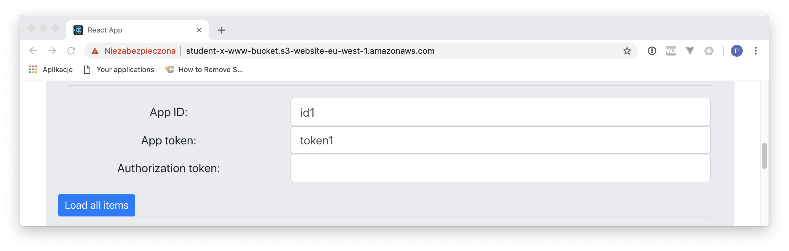

# LAB 4 - Managing APIs, adding X-Ray and consuming DynamoDB changes

## LAB Overview

#### This lab will demonstrate:
 * How to change API
 * How to use DynamoDB streams

## Task 1: Adding GET method to existing API endpoint

In this task you will create change Lambda function and add GET method to your existing API.

1. In the AWS Management Console, on the **Services** menu, click **Cloud9**.
2. Find your environment and open by clicking **Open IDE**.
3. Wait for your environment and when it's open *lambda_function.py* file.
4. Download file [lambda.py](lambda.py) and paste its content into editor window.
5. Open *manager.py* file.
6. Download file [manager.py](manager.py) and paste its content into editor window.
7. Edit the file and enter your bucket name instead of YOUR-BUCKET-NAME" and DynamoDB table name instead of "YOUR-DYNAMODB-TABLE". Lines 7 and 9.
8. Save all changes by choosing **File** menu and then **Save all**.
9. Right click your local function name, select **Deploy**.

10. In the AWS Management Console, on the **Services** menu, click **API Gateway**.
11. Find your API and click on its name.
12. Select your main resource, click **Actions** and select **Create method**.
13. From the dropdown menu select *GET* and approve change.
14. Choose **Lambda Function** as an **Integration type**.
15. Check the **Use Lambda Proxy Integration** checkmark.
16. Select your AWS region and choose your Lambda function.
17. Leave the **Use Default Timeout** checkmark unchanged.
18. Click **Save**.
19. Click **OK** when asked for permisions.
21. From the **Actions** menu select **Deploy API**.
22. Click **Actions** and select **Deploy API**.
23. Select your existing deployment stage and click **Deploy**.

Now you have GET API method. This method returns all licenses issued for an app.

Sample *curl* request to test the endpint.

``
curl -s -X GET \
  'https://<URL OF YOUR API>/<STAGE>?app_id=id1&app_token=token1' \
  -H 'Content-Type: application/json' \
  -H 'cache-control: no-cache'
``

You can also use the web app to make that request. You do not need **Authorization token** for now.   

## Task 2. Adding X-Ray traces.

In this task you will add X-Ray traces to your Lambda and API Gateway. This service will allow you to trace all requests made to your solution.

1. In the AWS Management Console, on the **Services** menu, click **Lambda**.
2. Find your Lambda function and click on its name.
3. Scroll down to **Debugging and error handling**.
4. Check **Enable active tracing** checkmark.
5. Click **Save**
6. In the AWS Management Console, on the **Services** menu, click **API Gateway**.
7. Find your API and click on its name.
8. Select **Stages** on the left menu.
9. Select your stage and click **Logs/Tracing**.
10. Check **Enable X-Ray Tracing** checkmark.
11. Click **Save Changes**.
12. Use [Postman](https://www.getpostman.com/), *curl* or any other tool and invoke your APIs several time.
13. In the AWS Management Console, on the **Services** menu, click **X-Ray**.
14. Select **Service map** on the left menu.

Now you can see the map of your API. you can click on any of the elements and inspect service details.

15. Select **Traces** on the left menu.

Now you can see all client requests.

16. Click on an of the trace and inspect detailed metrics.

## Task 3. Adding and consuming DynamoDB streams.

In this task you will add a stream to your DynamoDB table and will consume table changes using Lambda function.

1. In the AWS Management Console, on the **Services** menu, click **Lambda**.
2. Click **Create function**..
3. Select **Blueprints**.
4. Type *dynamodb* into **Search box** and press **Enter**.
5. Select *dynamodb-process-stream-python3* blueprint.
6. Click **Configure**.
7. Enter a name for your Lambda function, e.g. "consume-stream-lambda".
8. Choose **Create a new role from one or more templates** as a **Role**.
9. Enter a name for the role, e.g. "consume-stream-lambda-role".
10. Scroll down and check **Enable trigger** checkmark.
11. Click **Create function**.

Now, you need to assign permissions to your Lambda function.

12. In the AWS Management Console, on the **Services** menu, click **IAM**.
13. Click **Roles**.
14. Find "consume-stream-lambda-role" role and click on its name.
15. Click **Attach policies**.
16. Find *AWSLambdaInvocation-DynamoDB* policy and check the checkmark left to the policy name.
17. Click **Attach policy**.

18. In the AWS Management Console, on the **Services** menu, click **DynamoDB**.
19. Click **Tables**, find your table and click on its name.
20. Click on **Triggers** tab.
21. Click **Create trigger** and select **Existing Lambda function**.
22. In the dropdown menu, select the function you created in the previuos step.
23. Set batch size to 10.
24. Click **Create**.

25. Use [Postman](https://www.getpostman.com/), *curl* or any other tool and invoke your POST API and create a few licenses.

26. Open your "consume-stream-lambda" function.
27. Click **Monitoring** and **View logs in CloudWatch**.

In the CloudWatch log you can see that changes made to your DynamoDB table now invokes "consume-stream-lambda" Lambda function. You can use it in many ways. 

You can manage streams in the **Overview** panel in your DynamoDB console. 

## END LAB

  

