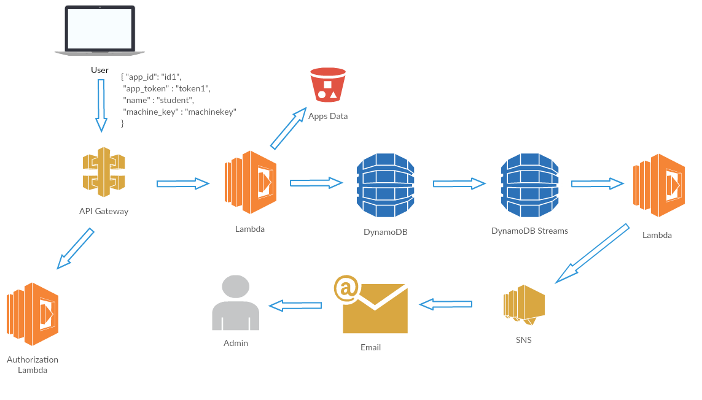
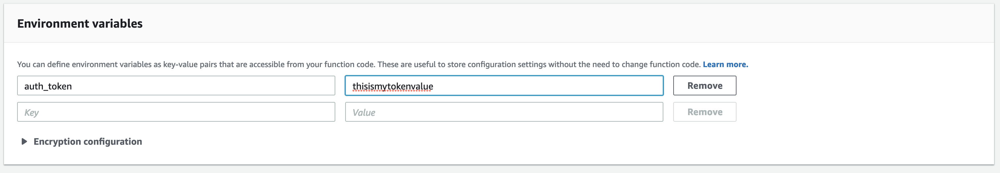
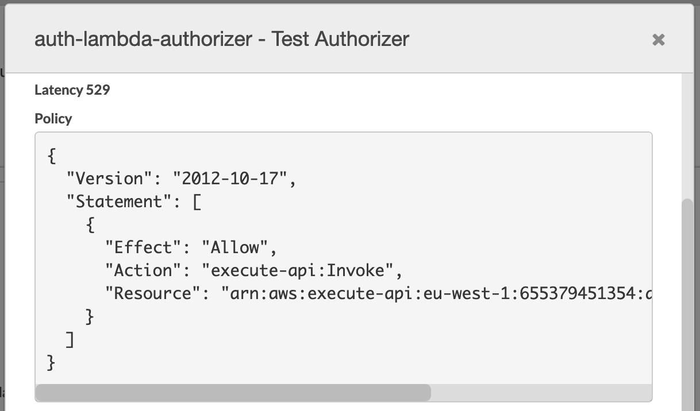
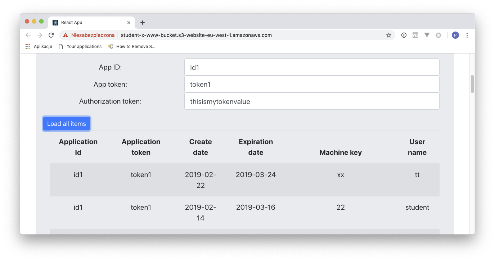

# LAB 5 - Sending notifications and authorizing API requests.

## LAB Overview

#### This lab will demonstrate:
 * How to use SNS to send notifications
 * How to use custom authorizers to authorize API calls

## Task 1: Adding SNS topic

In this task you will create change SNS topic and will subscribe your email to that topic.

1. In the AWS Management Console, on the **Services** menu, click **Simple Notification Service**.
2. Click **Topics** and **Create new topic**.
3. Enter a name for your topic, e.g. "license-change-topic".
4. Click **Create topic**.
5. Copy the ARN number of your Topic to the notepad.
6. Select your topic by checking the checkmark left to the name.
7. Click **Actions** and select **Subscribe to topic**.
8. Select **Email** as a **Protocol**.
9. Enter your emaill address as an endpoint.
10. Click **Create subscription**.

Now, confirmation message has been sent to your mailbox. Open it and click on the confirmation link inside the message.
10. Save your topic ARN for later use.
11. Click **Subscriptions** on the left menu. Refresh if neccessary. There should be your subscripion confirmed.

## Task 2. Changing Lambda function to send notifications

1. In the AWS Management Console, on the **Services** menu, click **Lambda**.
2. Find your "consume-stream-lambda" and click on its name.
3. Download [sns_lambda.py](sns_lambda.py) file and copy its content to your Lambda function edytor.
4. Paste the name of your SNS topic ARN in place of "<YOUR-SNS-TOPIC-ARN>".
5. Click **Save**.

Now, you need to assign SNS permissions to your Lambda function.

6. In the AWS Management Console, on the **Services** menu, click **IAM**.
7. Click **Roles**.
8. Find "consume-stream-lambda-role" role and click on its name.
9. Click **Attach policies**.
10. Find *AmazonSNSFullAccess* policy and check the checkmark left to the policy name.
11. Click **Attach policy**.
12. Use [Postman](https://www.getpostman.com/), *curl* or any other tool and invoke your POST API and create a few licenses.
13. Check your mailbox. You should get emails containing new licenses data.

## Task 3. Adding custom authorizers to your API.

In this task you'll add authorization for your GET merthod.

1. In the AWS Management Console, on the **Services** menu, click **Lambda**.
2. Click **Create function**.
3. Enter a name, e.g. "auth-lambda".
4. Select **Python 3.6** as a runtime.
5. Choose **Create a new role from one or more templates** as a **Role**.
6. Enter a name for the role, e.g. "auth-lambda-role".
7. Click **Create function**.
8. Download [auth_lambda.py](auth_lambda.py) file and copy iys content into editor field.
9. Scroll down to **Environment variables** and set a value for *auth_token* variable.

10. Click **Save**.

11.  In the AWS Management Console, on the **Services** menu, click **API Gateway**.
12. Find your API and click on its name.
13. Click **Authorizers** and **Create New Authorizer**.
14. Enter a name for your authorizer, e.g. "auth-lambda-authorizer".
15. Set **Lambda** as the type.
16. Select your authorization Lambda which you prepared in the previous step.
17. Select **Token** as a **Lambda Event Payload**.
18. Enter a **Token Source**. Set it to "Authorization". This is the request header which will be sent to your Lambda function.
19. Set **TTL** to 30 seconds.
20. Click **Create**.
21. Click **Grant & Create** if needed.

22. Click **Test**.
23. Type your correct auth token value (the value you used in environment variables for your Lambda function).
24. Click **Test** once again.

25. Enter different value for test token and test it again. You should get a policy with explicit *Deny*.

``
{
  "Version": "2012-10-17",
  "Statement": [
    {
      "Effect": "Deny",
      "Action": "execute-api:Invoke",
      "Resource": "arn:aws:execute-api:eu-west-1:1234567890:ac4vomawb6/ESTestInvoke-stage/GET/"
    }
  ]
}
``

26. Click **Resources**.
27. Select **GET** method and then **Method Request**.
28. In the **Settings** section expand the Authorization drop-down list to select the Lambda authorizer you just created, and then choose the check mark icon to save the choice. If your authorizer is not available, reload the page.
29. Click **Actions** and select **Deploy API**.
30. Select your stage and click **Deploy**.

Now you have GET API method with authorization. This method returns all licenses issued for an app, but need an authorization token *Authorization**.

31. Using your tool test both authorized and unathorized request.

Sample *curl* request to test the endpint without authorization token:

``
curl -s -X GET \
  'https://<URL OF YOUR API>/<STAGE>?app_id=id1&app_token=token1' \
  -H 'Content-Type: application/json' \
  -H 'cache-control: no-cache'
``

And with authorization token sent to the endpoint:

``
curl -s -X GET \
  'https://<URL OF YOUR API>/<STAGE>?app_id=id1&app_token=token1' \
  -H 'Content-Type: application/json' \
  -H 'Authorization: thisismytokenvalue' \
  -H 'cache-control: no-cache'
``

You can also use the web app to test authorization.

## END LAB

  