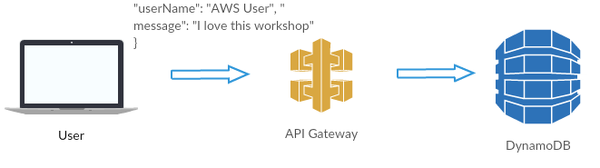
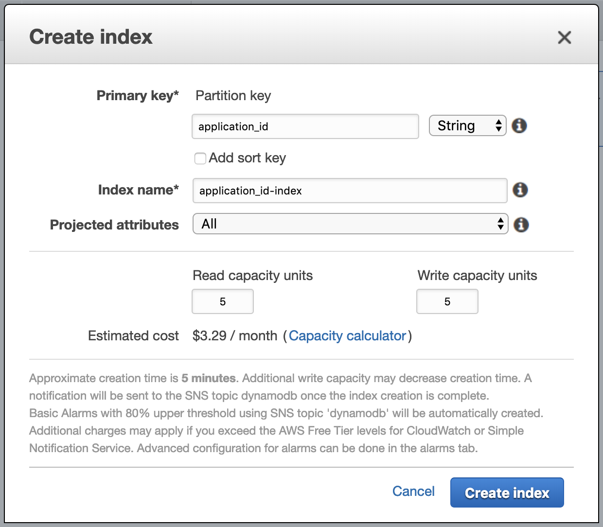
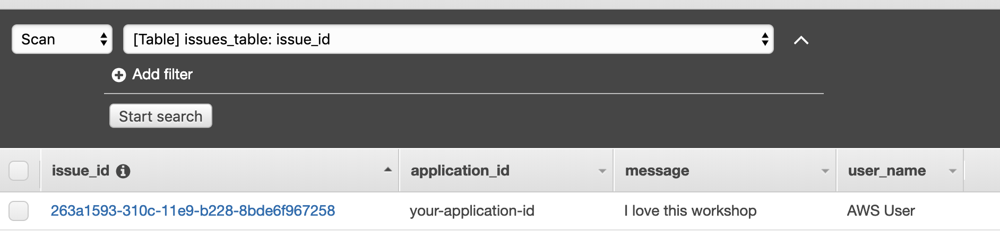
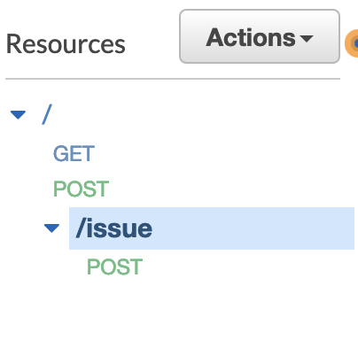
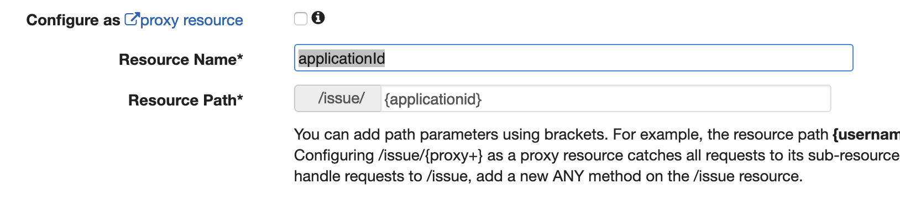
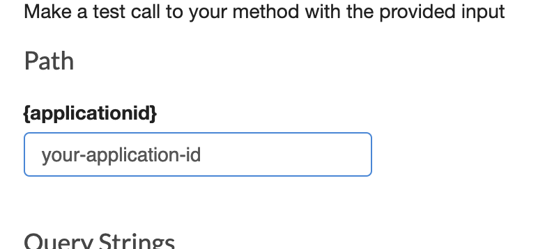
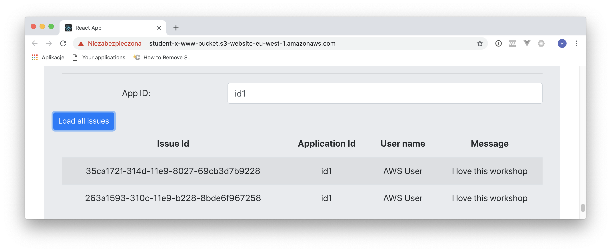

# LAB 6 - Saving data directly to DynamoDB table using API Gateway as a proxy.

## LAB Overview

#### This lab will demonstrate:
 * How to save your data to DynamoDB table directly. No Lambdas involved.

## Task 1: Adding DynamoDB table.

In this task you will create DynamoDB table.

1. In the AWS Management Console, on the **Services** menu, click **DynamoDB**.
2. Click **Create table**.
3. Enter a name for your table, e.g. "student-issues-x-table".
4. Name your *Primary key* as "issue_id" and set the type to "String".
5. Uncheck **Use default settings**.
6. Turn off "Auto scaling" by unchecking **Read capacity** and **Write capacity**.
7. Click **Create**.

After your table is populated...

8. Click **Indexes** and **Create index**.
9. Enter a name for the **Partition key**, e.g. "application_id".

10. Leave the rest unchanged and click **Create index**.

## Task 2. Creating role for API Gateway.

In this tak you will prepare a role for API Gateway. You need to add permissions to access DynamoDB.
1. In the AWS Management Console, on the **Services** menu, click **IAM**.
2. Click **Roles**.
3. Click **Create role**.
4. Select **API Gateway** as a service.
5. Click **Next: Permissions**.
6. Click **Next: Tags** and **Next: Review**.
7. Enter a name for the role, e.g. "apigateway-dynamodb-role" and click **Create role**.
8. Find your role and click on its name.
9. Click **Attach policies**.
10. Find "AmazonDynamoDBFullAccess" policy and add it to the role.
11. Save the ARN of the role.

## Task 3: Adding API resource (endpoint) to your existing API..

In this task you will create second resource in your API.

1. In the AWS Management Console, on the **Services** menu, click **API Gateway**.
2. Find your API and click on its name.
3. Click **Actions** and select **Create resource**.
4. Enter an name for the resurce, e.g. "issue".
5. Check **Enable API Gateway CORS**.
6. Click **Create Resource**.
7. Select your new resource, click **Actions** and select **Create Method**.
8. Expand the method drop-down, select **POST**, and then choose the check mark icon to save the choice.
9. Select **AWS Service** as the **Integration type**.
10. Expand the **AWS Region** drop-down, select your region.
11. Expand the **AWS Service** drop-down, select **DynamoDB**.
12. Set **HTTP method** to **POST**.
13. Leave **Action Type** as **Use action name**.
14. Type *PutItem* into **Action**.
15. Enter the ARN of the role you created in the previous step.
16. Click **Save**.

## Task 4. Creating mapping templates.

In this task you will create a mapping template for your POST request.

1. Select your **POST** method.
2. From the **Method Execution screen**, choose **Integration Request**.
3. Expand the **Mapping Templates** section.
4. Choose **Add mapping template**. 
5. Select **When there are no templates defined (recommended)** for **Request body passthrough**.
6. Under **Content-Type**, type "application/json" and then choose the check mark to save changes.   
7. Download [post_mapping_template.json](post_mapping_template.json), copy its content and paste it into template field.
8. Type your DynamoDb table name instead of "YOUR TABLE NAME".
9. Click **Save**.
10. Click **Actions** and select **Deploy API**.
11. Select your stage and click **Deploy**.

## Task 5. Testing the solution.

In this task you will test if your data is saved to DynamoDB table. You'll need a POST request with a payload shown below:

``
{
  "applicationId": "your-application-id",
  "userName": "AWS User",
  "message":  "I love this workshop"
}
``

1. Use your preffered tool and send POST request to your new api.

Below you have a sample *curl* command.

``
curl -X POST \
  https://<URL OF YOUR API>/<STAGE>/issue \
  -H 'Content-Type: application/json' \
  -H 'cache-control: no-cache' \
  -d '{
  "applicationId": "your-application-id",
  "userName": "AWS User",
  "message":  "I love this workshop"
}'
``

2. Open your DynamoDB table.
3. Click **Items**.
4. Look for your saved item.

## Task 6. Creating GET API.

In this task you will create GET API to retrieve applications comments or issues.

1. Open your API and select */issue* resource.

2. Click **Actions** and select **Create resource**.
3. Enter "applicationId" as a **Resource name** and "{applicationId}" as a **Resource Path**.

4. Check **Enable API Gateway CORS**.
5. Click **Create resource**.
6. In **Resources** choose your new resource **/{applicationId}**.
7. Click **Actions** and select **Create method**.
8. Expand the method drop-down, select **GET**, and then choose the check mark icon to save the choice.
9. Select **AWS Service** as the **Integration type**.
10. Expand the **AWS Region** drop-down, select your region.
11. Expand the **AWS Service** drop-down, select **DynamoDB**.
12. Set **HTTP method** to **POST**. 
13. Leave **Action Type** as **Use action name**.
14. Type *Query* into **Action**.
15. Enter the ARN of the role you created in task 2.
16. Click **Save**.
17. From the **Method Execution screen**, choose **Integration Request**.
18. Expand the **Mapping Templates** section.
19. Select **When there are no templates defined (recommended)** for **Request body passthrough**.

20. Choose **Add mapping template**. 

21. Under **Content-Type**, type "application/json" and then choose the check mark to save changes.   
22. Download [get_mapping_template.json](get_mapping_template.json), copy its content and paste it into template field.
23. Type your DynamoDb table name instead of "\<YOUR TABLE NAME\>" and your index name instead of "\<YOUR-INDEX-NAME\>".
24. Click **Save**.
25. Click **Actions** and select **Deploy API**.
26. Select your stage and click **Deploy**.

You can test this mapping inside of your API Gateway interface if you want. 

27. Select your newly created **GET** method.
28. Click **Test** button.
29. Enter any of your application id that you have issues/comments for saved in your DynamoDB table as **Path**.

30. Click **Test**.

You should get a response similiar to:

``
{
  "Count": 1,
  "Items": [
    {
      "application_id": {
        "S": "your-application-id"
      },
      "message": {
        "S": "I love this workshop"
      },
      "issue_id": {
        "S": "263a1593-310c-11e9-b228-8bde6f967258"
      },
      "user_name": {
        "S": "AWS User"
      }
    }
  ],
  "ScannedCount": 1
}
``

If everything went well you can move to next step and create response mapping template.

31. From the **Method Execution screen** for your GET method , choose **Integration Response**.
32. Expand the 200 response code by choosing the arrow on the left.
33. Expand the *Mapping Templates* section.
34. Download [get_response_mapping_template.txt](get_response_mapping_template.txt) file, copy its content and paste it into mapping editor.
35. Scroll down, and click **Save**.
36. Return to **Method execution** page and test your API once again.

Now the response should look like that:

``
{
  "issues": [
    {
      "issueId": "263a1593-310c-11e9-b228-8bde6f967258",
      "applicationId": "your-application-id",
      "userName": "AWS User",
      "message": "I love this workshop"
    }
  ]
}
``

37. Add CORS to your /issue resource. (Actions -> Enable CORS)
38. If it's OK, deploy your API.
39. Use your preffered tool to test the API. If you use *curl* that is the command:

``
curl -X GET \
  https://<URL OF YOUR API>/<STAGE>/issue/<your-application-id> \
  -H 'cache-control: no-cache'
``

You can also use the web app to test **GET** method.

## END LAB

  